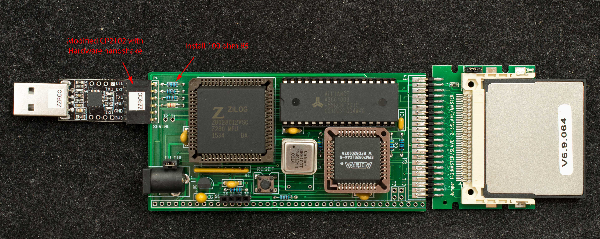
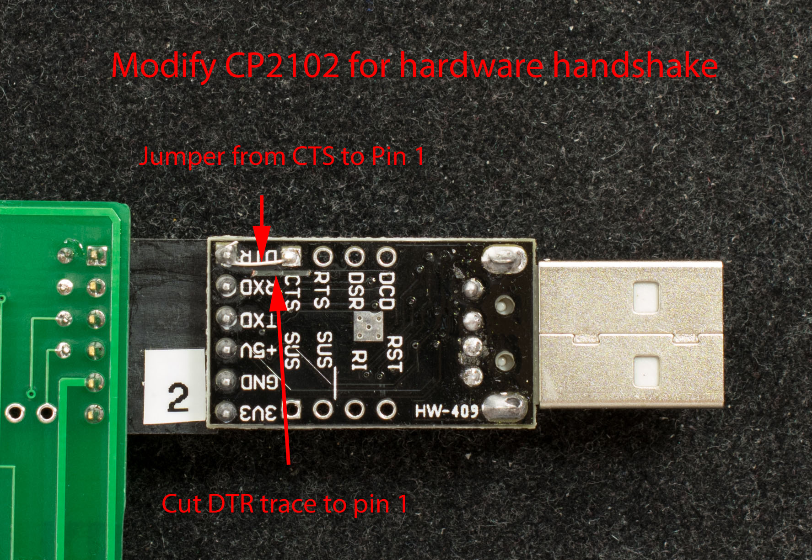

# Serially Load and Run ROMWBW on ZZRCC
### Introduction
The following are hardware and software required to run ver 3.1.1 pre.56 (or later) ROMWBW on ZZRCC.

### Hardware
To enable hardware handshake, 100 ohm resistor R5 must be installed. On the CP2102 USB-serial adapter the DTR trace to pin 1 needs to be cut and a jumper added from CTS pad to pin 1 of the header.

www.retrobrewcomputers.org_lib_plugins_ckgedit_fckeditor_userfiles_image_builderpages_plasmo_zzrcc_applications_romwbw_zzrcc_for_romwbw.jpg



Software
ROMWBWldr is needed to load ROMWBW as Intel Hex file. To convert ROMWBW.rom to Intel Hex file with extended linear addressing:
```
bin2hex /4 RCZ280.rom RCZ280.hex
```
Edit RCZ280.hex file so data in address range 0x5000 to 0x6FFF are removed. This is because ROMWBWldr resides in 0x50xx and use 0x60xx as buffer for incoming data. while in ZZRCC monitor prompt, send ROMWBWldr.hex to ZZRCC and type 'g 5000' to run ROMWBWldr; send RCZ280.hex when prompted by ROMWBWldr. Once RCZ280.hex is loaded, it will automatically execute from 0x0.

- [ROMWBWldr](romwbwldr.zip) source and executable.
- [RCZ280.hex v3.1.1 pre.56](rcz280.zip) with data in address range 0x5000 to 0x6FFF already removed.
[Zipped image of RomWBW](hd1024_zzr_combo_image.zip) ← temporary image, will updated with latest RomWBW and repost.

10/13/23. Lots of changes since last update.

Need to edit the .hex file to remove the top 32K of .hex file so not to write over the zzrcc monitor

