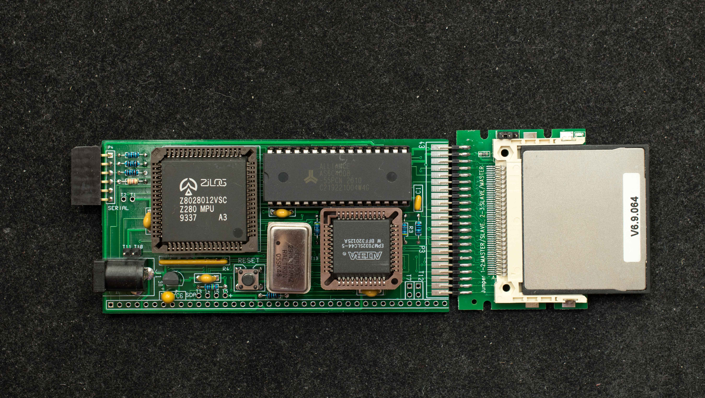
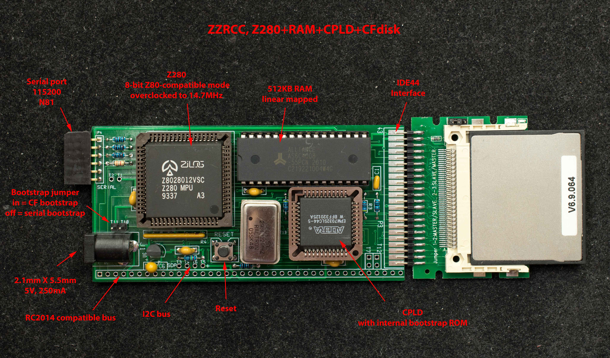
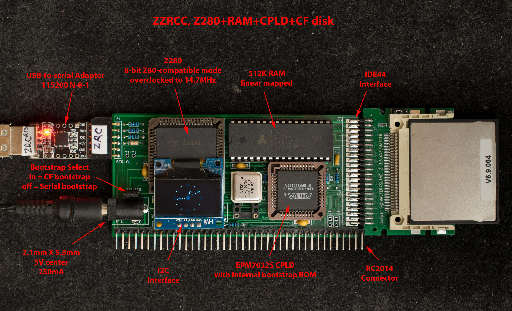
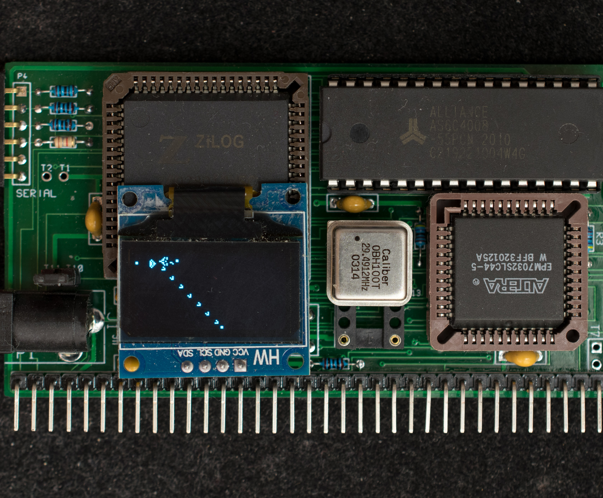
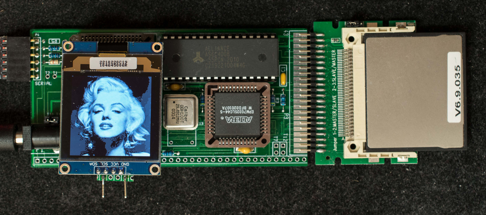
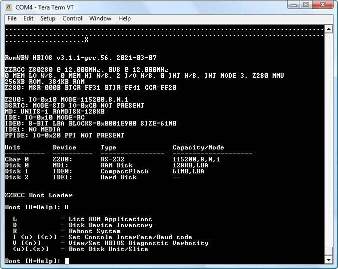

# ZZRCC, Z280+RAM+CPLD+CF, a SBC for RC2014 based on Z280
## Introduction
ZZRCC (Z280, RAM, CPLD, and CF disk) is the replacement for [ZZ80CF](https://github.com/Plasmode/ZZ80CF).  It fixed the asynchronous baud clock that intermittently injected an extra character in the serial output.  ZZRCC follows the basic concept of [ZRCC](https://github.com/Plasmode/ZRCC) that uses a small CPLD to bootstrap from CF disk. Because Z280 has a native serial-bootstrap capability, the CPLD is even simpler than that of ZRCC. ZZRCC is Z280 operating in Z80-compatible mode. It is designed for RC2014 bus.

## Features
- Z280 operating at 14.7MHz
- EPM7032SLC44 CPLD
- 512K RAM
- Compact flash interface
- Two modes of operation:
  - Serial bootstrap to install software in a new CF disk
  - CF bootstrap to load software from initalized CF disk
- Console serial port at 115200 N-8-1
- I2C interface
- CP/M2.2 and ROMWBW ready
- Compatible with RC2014 bus
- 100mm X 50mm 2-layer pc board

## Theory of Operation
ZZRCC use a small CPLD, EPM7032S, to hold 32-bytes of ROM mapped to 0x0 after reset. When set to CF bootstrap mode, the ROM assumes the CF disk already has the bootstrap code in its master boot record and loads the content of the master boot record in 0xB000 and jump into it. The mapping of 32-byte ROM to memory location 0x0 can be disabled by writing to an I/O location.

When set to serial bootstrap mode, the 32-byte ROM is disabled and Z280 waits for 256 bytes of serial data (115200, Odd parity, 8 data, 1 stop) and start program execution when 256 bytes of serial data have been received. The serial bootstrap mode is used mainly to initialize the CF disk with bootstrap and operational software so ZZRCC can boot from CF disk which is the normal mode of operation.

## Design Information
- [Schematic](zzrcc_rev0_scm.pdf)
- [Gerber photoplots](zzrcc_gerber_rev0.zip)
- [CPLD design](zzrcc_i2c_cpld_12-18-20.zip)
- [Bill of Materials](zzrcc_rev0pcb_bom.pdf)

## Software
- [ZZRCC Serial Loader](Software/zrserloader_v0_1_12_20_20.zip). A small 256-byte program designed to be serially loaded into ZZRCC when configured to serial bootstrap mode.
- [ZZRCC Monitor](Software/zzrmon_v0_5_released.zip). A simple monitor for ZZRCC
- [CF Bootloader](Software/updated_cfbootloader_1_8_21.zip). An utility program that copies bootstrap program to Master Boot Block of a CF disk and ZZRCC Monitor to designated space of CF disk.
- [SCMonitor+StarTrek](Software/scmonitor_startrek_zzrcc.zip). This is Steve Cousin's SCMonitor ported to ZZRCC. This is [Steve Cousin's homepage](https://smallcomputercentral.wordpress.com/). As an extra bonus, it includes the StarTrek program in BASIC. To install SCMonitor+StarTrek, send scmonitor_startrek.hex to ZZRCC and type 'c1' to install it in track 0 of CF disk. Once it is installed, type 'b1' to load and run SCMonitor. To run Startrek in BASIC, type 'wbasic', then 'run'. Have fun! [Youtube video](https://www.youtube.com/watch?v=CbfR3bzuxMc) of running Startrek in ZZRCC using a [TeraTerm macro file](Software/zzrcc_install_all_teraterm_macro.zip). This is the TeraTerm macro program

- [CP/M2.2 BIOS/CCP/BDOS](Software/cpm22_v0_1_12_20_20.zip) for ZZRCC. To install it, send cpm22all.hex to ZZRCC and type 'c2' to install it in track 0 of CF disk. Once it is installed, type 'b2' to load and run CP/M2.2

- [XMODEM.HEX](https://github.com/Plasmode/Z80SBC64/blob/main/Software/xmodem.hex). This is the very first program in a new ZZRCC CF disk. Install CP/M2.2 above first, then while in ZZRCC Monitor, send xmodem.hex to ZZRCC; then type 'b2' to enter CP/M2.2; then type 'save 17 xmodem.com' at CP/M prompt. This will save the RAM image into a file called xmodem.com.

- [unarj.com](https://github.com/Plasmode/Z80SBC64/blob/main/Software/unarj.zip). This is file decompression program running in CP/M. Use it to decompress .arj files

- [cpm22dri](https://github.com/Plasmode/Z80SBC64/blob/main/Software/cpm22dri.zip). This is the CP/M2.2 distribution files from Digital Research. Use unarj.com to decompress it.

- [Zorkall](https://github.com/Plasmode/Z80SBC64/blob/main/Software/zorkall.zip) is Zork1, Zork2, and Zork3 compressed with arj. Use unarj.com above to decompress.

- [HTC309](https://github.com/Plasmode/Z80SBC64/blob/main/Software/htc309.zip) is version 3.09 of HiTech C that has been released into publica domain. It is compressed with arj, use unarj.com above to decompress

- Installation macro for ZZRCC CF disk. This [zipped file](Software/zzrcc_install_all_teraterm_macro.zip) contains all the files that are installed in a released ZZRCC disk. The installation macro runs in TeraTerm and expects all files in directory c:\teraterm\zzrcc Run the macro once the serial loader is loaded and the serial port is changed back to 115200 N81.

## Manuals and Instructions
- [Getting started](Manuals/Getting_started.md) with ZZRCC
- ZZRCC Monitor manual
- Testing ZZRCC without CF disk
- [Z280 Technical manual](Manuals/z280_mpu_noocr_bw_400_.pdf)

## ToDo
CPM3

ZZRCC Monitor manual

## Projects
### I2C Interface
How to Interface to I2C connector on ZZRCC

### Interface to 128x64 OLED display
This is ZZRCC driving a 128×64 OLED display over the I2C bus. The clock is free-running rapidly mainly as a demonstration of I2C display interface capability. Load and run the clock demo program from 0x1000

Conway's Game of Life, Gosper Glider Gun, running on ZZRCC. Load and run the program from 0x1000

### Interface to 128x128 gray scale OLED display
This page describes the hardware and software interface to 128×128 grey scale OLED display

### Run ROMWBW on ZZRCC
Wayne Warthen's ROMWBW (v3.1.1 pre.56 or later) is under development to run on ZZRCC. This is an interim procedure for serially load ROMWBW in ZZRCC. A better solution under development is to save the ROMWBW image in CF disk so it can be quickly loaded with a monitor command.

